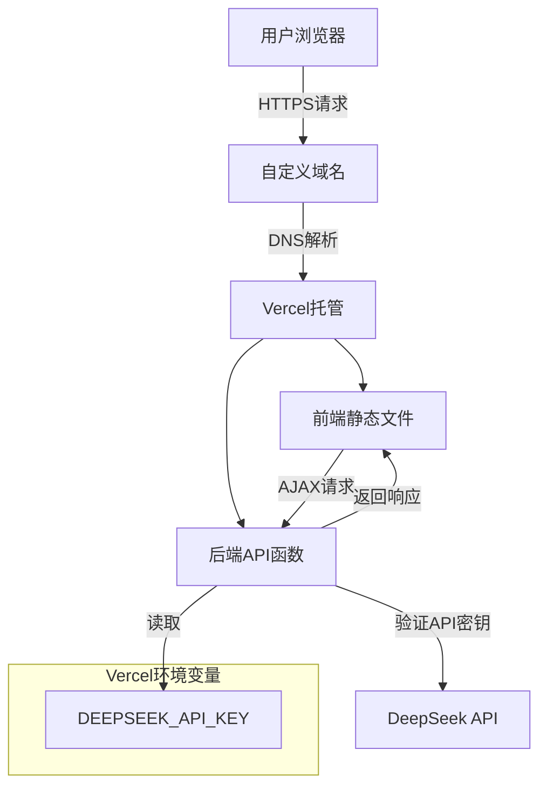

# DeepSeek风格聊天网站 - 详细架构设计

## 项目概述
构建一个类似DeepSeek的聊天网站，供亲朋好友使用，采用轻量级HTML/CSS/JS前端，后端代理保护API密钥。

## 安全架构设计原则
1. **API密钥零暴露**：DeepSeek API Key仅存储在Vercel环境变量中
2. **后端代理**：所有AI API调用通过后端无服务器函数进行
3. **简单密码保护**：前端可添加基本密码验证（可选）
4. **HTTPS加密**：通过Vercel自动提供SSL证书

## 系统架构图



## 技术栈

### 前端
- **HTML5**：页面结构
- **CSS3**：响应式设计，类似DeepSeek的简洁界面
- **Vanilla JavaScript**：轻量级，无框架依赖
- **Fetch API**：与后端通信

### 后端
- **Vercel Serverless Functions**：无服务器API端点
- **Node.js**：运行环境
- **Express风格路由**：处理HTTP请求

### 部署与基础设施
- **Vercel**：前端托管 + 后端函数
- **阿里云DNS**：域名解析
- **Git**：版本控制（可选）

## 项目目录结构

```
deepseek-chat-website/
├── public/                    # 静态文件
│   ├── index.html
│   ├── style.css
│   ├── script.js
│   └── assets/               # 图片、图标等
├── api/                      # Vercel Serverless Functions
│   ├── chat.js              # 主要聊天API端点
│   └── auth.js              # 密码验证端点（可选）
├── vercel.json              # Vercel配置
├── package.json             # Node.js依赖（后端）
└── README.md               # 部署说明
```

## 数据流设计

### 1. 用户访问流程
```
用户 → 输入网址 → DNS解析 → Vercel → 加载前端 → 显示聊天界面
```

### 2. 消息发送流程
```
前端输入消息 → JavaScript收集 → POST到/api/chat → 
后端函数验证 → 调用DeepSeek API → 处理响应 → 
返回给前端 → 显示AI回复
```

### 3. API密钥保护流程
```
前端：不包含任何API密钥
后端：process.env.DEEPSEEK_API_KEY读取环境变量
DeepSeek API：后端使用密钥调用，响应返回给前端
```

## 详细组件设计

### 前端组件
1. **聊天容器**：消息显示区域
2. **输入框**：用户消息输入
3. **发送按钮**：触发API调用
4. **历史记录**：保存会话历史（localStorage）
5. **设置面板**：密码设置、模型选择等

### 后端API端点
1. **POST /api/chat**
   - 接收：{ message: string, history: array }
   - 处理：调用DeepSeek Chat Completion API
   - 返回：{ reply: string, usage: object }

2. **POST /api/verify**（可选）
   - 接收：{ password: string }
   - 处理：验证简单密码
   - 返回：{ valid: boolean }

## 安全措施

### 1. API密钥保护
- 存储在Vercel环境变量中
- 不在代码仓库中硬编码
- 后端函数仅允许特定来源的CORS请求

### 2. 请求限制
- 可添加简单的速率限制
- 可验证请求来源（Referer检查）
- 可添加请求签名（增强安全性）

### 3. 数据传输安全
- HTTPS强制加密
- 敏感数据不在URL中传输

## 部署步骤概述

1. **本地开发**：创建项目文件，测试功能
2. **Vercel部署**：连接Git仓库或直接上传
3. **环境变量配置**：在Vercel控制台设置API密钥
4. **域名配置**：在阿里云DNS添加CNAME记录
5. **SSL证书**：Vercel自动配置HTTPS
6. **功能测试**：验证完整流程

## 成本估算
- **Vercel Hobby计划**：免费（每月100GB带宽，1000小时函数运行时间）
- **DeepSeek API**：按使用量计费（个人使用成本极低）
- **域名**：已购买，无额外费用

## 扩展性考虑

### 未来可扩展功能
1. **多用户支持**：简单的用户系统
2. **文件上传**：支持图片、文档分析
3. **模型切换**：支持不同AI模型
4. **历史记录同步**：云端存储会话
5. **移动端优化**：PWA应用支持

### 性能优化
1. **流式响应**：支持SSE或WebSocket实时流
2. **缓存机制**：常见问题缓存
3. **CDN加速**：Vercel全球CDN

## 风险与缓解

### 潜在风险
1. **API滥用**：未经授权访问
   - 缓解：密码保护、IP限制、请求频率限制

2. **成本超支**：API使用量过大
   - 缓解：设置使用量监控、添加使用量提醒

3. **服务中断**：Vercel或DeepSeek服务问题
   - 缓解：添加降级方案、错误友好提示

## 下一步行动
参考TODO列表，按步骤实施项目。